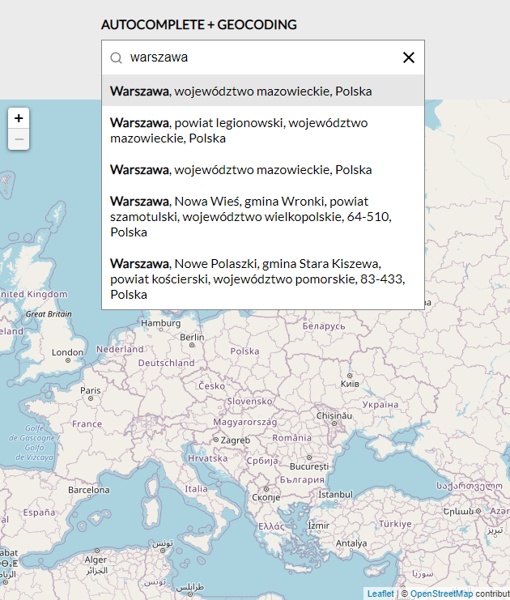

<h2 align="center">
Leaflet.Autocomplete GeoSearch outside map
</h2>

<p align="center">
  Leaflet.Autocomplete is to expand the autosugestion plugin with the ability to geocode and show data on the map in the way you think you need
</p>

<p align="center">
  
  <a href="LICENSE">
    
  </a>
</p>

<p align="center">
  
</p>

This example uses remote api for geocoding [NOMINATIM-API](https://nominatim.org/release-docs/latest/api/Search/) in GeoJSON format


This example is based on the library **[AUTOSUGGEST](https://github.com/tomik23/autosuggest)**


## Demo
See the demo - [example](https://tomik23.github.io/Leaflet.Autocomplete/)

## Features
- Use remote api or static files, e.g. in the GeoJSON format, but there is nothing to prevent it from being a different format.
- Accessible, with full support for ARIA attributes and keyboard interactions.
- Customize your own CSS.
- Support for asynchronous data fetching.
- Move between the records using the arrows <kbd>↓</kbd> <kbd>↑</kbd>, and confirm by <kbd>Enter</kbd>
- No dependencies

## Usage

HTML
```html
<div class="search">
  <input type="text" autocomplete="off" id="search" class="full-width" placeholder="enter the city name">
</div>
```

CSS
```html
  <link rel="stylesheet" href="./autosuggest.min.css">
  <link rel="stylesheet" href="./global.min.css">
```

JS
```html
 <script src="./autosuggest.min.js"></script>
```

### JS for AUTOCOMPLETE

```js
// minimal configure
new Autosuggest('search', {
  // delay without which the server would not survive ;)
  delay: 1000, 

  // The parameter set to true adds a button to delete the text
  // from the input field, a small x to the right of the input field
  clearButton: true, 
  
  // default selects the first item in
  // the list of results
  selectFirst: true,

  // The number of characters entered should start searching
  howManyCharacters: 2,

  // onSearch
  onSearch: (input) => {
    // You can also use static files
    // const api = '../static/search.json'
    const api = `https://nominatim.openstreetmap.org/search?format=geojson&limit=5&q=${encodeURI(input)}`;

    /**
     * jquery
     */
    // return $.ajax({
    //     url: api,
    //     method: 'GET',
    //   })
    //   .done(function (data) {
    //     return data
    //   })
    //   .fail(function (xhr) {
    //     console.error(xhr);
    //   });

// OR -------------------------------

    /**
     * axios
     * If you want to use axios you have to add the
     * axios library to head html
     * https://cdnjs.com/libraries/axios
     */
    // return axios.get(api)
    //   .then((response) => {
    //     return response.data;
    //   })
    //   .catch(error => {
    //     console.log(error);
    //   });

// OR -------------------------------

    /**
     * Promise
     */
    return new Promise((resolve) => {
      fetch(api)
        .then(response => response.json())
        .then(data => {
          resolve(data.features)
        })
        .catch(error => {
          console.error(error);
        })
    })
  },
  // nominatim GeoJSON format parse this part turns json into the list of
  // records that appears when you type.
  onResults: (matches, input) => {
    const regex = new RegExp(input, 'i');
    return matches.map((element) => {
      return `
        <li class="autocomplete-item loupe" role="option" aria-selected="false">
          <p>
            ${element.properties.display_name.replace(regex, (str) => `<b>${str}</b>`)}
          </p>
        </li> `;
    }).join('');
  },
  // we add an action to enter or click

  onSubmit: (matches, input) => {
    const { display_name } = matches.properties;
    const cord = matches.geometry.coordinates;

    // custom id for marker
    const customId = Math.random();

    // create marker and add to map
    const marker = L.marker([cord[1], cord[0]], {
      title: display_name,
      id: customId
    })
      .addTo(map)
      .bindPopup(display_name);

    // sets the view of the map
    map.setView([cord[1], cord[0]], 8);

    // removing the previous marker
    // if you want to leave markers on
    // the map, remove the code below
    map.eachLayer(function (layer) {
      if (layer.options && layer.options.pane === "markerPane") {
        if (layer.options.id !== customId) {
          map.removeLayer(layer);
        }
      }
    });
  }
});
```

### MAP initialization

```js
const config = {
  minZoom: 6,
  maxZomm: 18,
};
// magnification with which the map will start
const zoom = 3;

// coordinates
const lat = 52.22977;
const lng = 21.01178;

// calling map
const map = L.map('map', config).setView([lat, lng], zoom);

// Used to load and display tile layers on the map
L.tileLayer('https://{s}.tile.openstreetmap.org/{z}/{x}/{y}.png', {
  attribution:
    '&copy; <a href="https://www.openstreetmap.org/copyright">OpenStreetMap</a> contributors',
}).addTo(map);

```
## Other options

This example geocodes addresses, but nothing prevents you from showing polygons or other things on the map. Anything you add to `data-elements` can be handled by you and shown on the map.