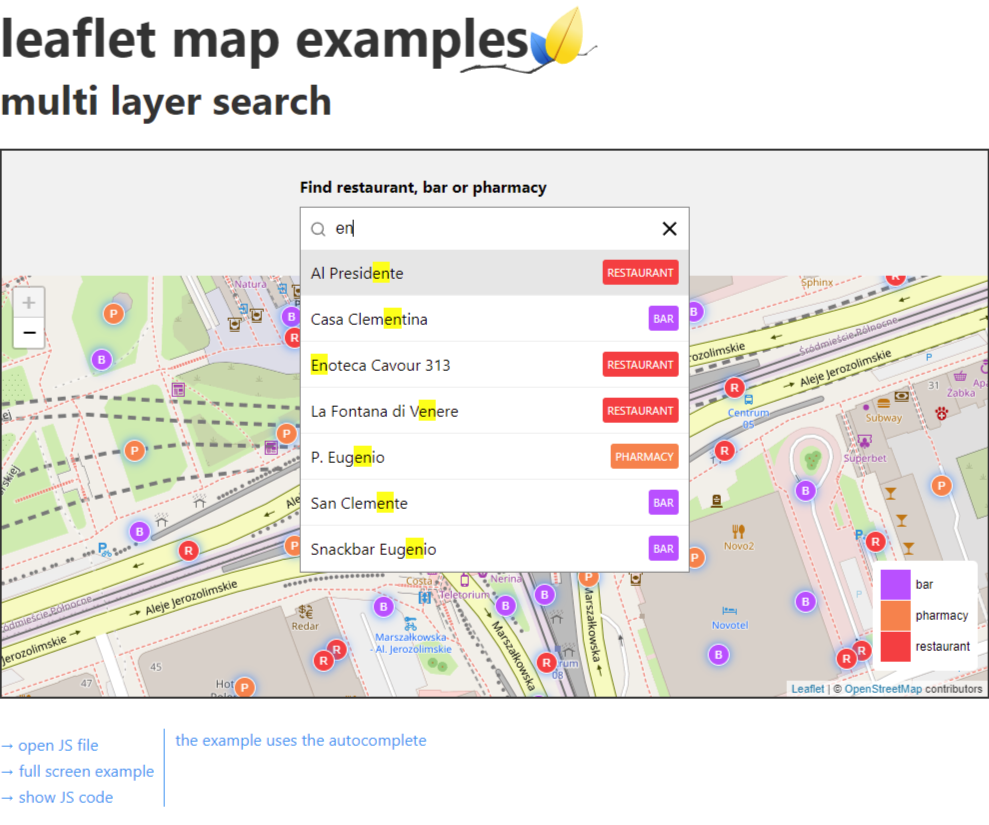

<h2 align="center">
Leaflet.Autocomplete GeoSearch outside map
</h2>

<p align="center">
  Leaflet.Autocomplete is to expand the autocomplete plugin with the ability to geocode and show data on the map in the way you think you need
</p>

<p align="center">
  
  <a href="LICENSE">
    
  </a>
</p>

<p align="center">
  
</p>

This example uses remote api for geocoding [NOMINATIM-API](https://nominatim.org/release-docs/latest/api/Search/) in GeoJSON format and is based on the library **[AUTOCOMPLETE](https://github.com/tomik23/autocomplete)**

## Demo

See the demo - [example](https://tomik23.github.io/Leaflet.Autocomplete/)

You can also use the autocomplete library on a map, see this example: [autocomplete-on-map](https://tomik23.github.io/leaflet-examples/#50.autocomplete-on-map)

## Features

- Use remote api or static files, e.g. in the GeoJSON format, but there is nothing to prevent it from being a different format.
- Accessible, with full support for ARIA attributes and keyboard interactions.
- Customize your own CSS.
- Support for asynchronous data fetching.
- Move between the records using the arrows <kbd>↓</kbd> <kbd>↑</kbd>, and confirm by <kbd>Enter</kbd>
- No dependencies

## Usage

HTML

```html
<div class="auto-search-wrapper">
  <input
    type="text"
    autocomplete="off"
    id="search"
    class="full-width"
    placeholder="enter the city name"
  />
</div>
```

CSS

```html
<link
  rel="stylesheet"
  href="https://cdn.jsdelivr.net/gh/tomik23/autocomplete@1.8.3/dist/css/autocomplete.min.css"
/>
```

JS

```html
<script src="https://cdn.jsdelivr.net/gh/tomik23/autocomplete@1.8.3/dist/js/autocomplete.min.js"></script>
```

### JS for AUTOCOMPLETE

> All parameters controlling the `AUTOCOMPLETE` library available on this page https://tomik23.github.io/autocomplete/

```js
// minimal configure
new Autocomplete("search", {
  // default selects the first item in
  // the list of results
  selectFirst: true,

  // The number of characters entered should start searching
  howManyCharacters: 2,

  // onSearch
  onSearch: ({ currentValue }) => {
    // You can also use static files
    // const api = '../static/search.json'
    const api = `https://nominatim.openstreetmap.org/search?format=geojson&limit=5&city=${encodeURI(
      currentValue
    )}`;

    /**
     * jquery
     */
    // return $.ajax({
    //     url: api,
    //     method: 'GET',
    //   })
    //   .done(function (data) {
    //     return data
    //   })
    //   .fail(function (xhr) {
    //     console.error(xhr);
    //   });

    // OR -------------------------------

    /**
     * axios
     * If you want to use axios you have to add the
     * axios library to head html
     * https://cdnjs.com/libraries/axios
     */
    // return axios.get(api)
    //   .then((response) => {
    //     return response.data;
    //   })
    //   .catch(error => {
    //     console.log(error);
    //   });

    // OR -------------------------------

    /**
     * Promise
     */
    return new Promise((resolve) => {
      fetch(api)
        .then((response) => response.json())
        .then((data) => {
          resolve(data.features);
        })
        .catch((error) => {
          console.error(error);
        });
    });
  },
  // nominatim GeoJSON format parse this part turns json into the list of
  // records that appears when you type.
  onResults: ({ currentValue, matches, template }) => {
    const regex = new RegExp(currentValue, "gi");

    // if the result returns 0 we
    // show the no results element
    return matches === 0
      ? template
      : matches
          .map((element) => {
            return `
          <li class="loupe">
            <p>
              ${element.properties.display_name.replace(
                regex,
                (str) => `<b>${str}</b>`
              )}
            </p>
          </li> `;
          })
          .join("");
  },

  // we add an action to enter or click
  onSubmit: ({ object }) => {
    // remove all layers from the map
    map.eachLayer(function (layer) {
      if (!!layer.toGeoJSON) {
        map.removeLayer(layer);
      }
    });

    const { display_name } = object.properties;
    const [lng, lat] = object.geometry.coordinates;

    const marker = L.marker([lat, lng], {
      title: display_name,
    });

    marker.addTo(map).bindPopup(display_name);

    map.setView([lat, lng], 8);
  },

  // get index and data from li element after
  // hovering over li with the mouse or using
  // arrow keys ↓ | ↑
  onSelectedItem: ({ index, element, object }) => {
    console.log("onSelectedItem:", index, element, object);
  },

  // the method presents no results element
  noResults: ({ currentValue, template }) =>
    template(`<li>No results found: "${currentValue}"</li>`),
});
```

### MAP initialization

```js
const config = {
  minZoom: 6,
  maxZomm: 18,
};
// magnification with which the map will start
const zoom = 3;

// coordinates
const lat = 52.22977;
const lng = 21.01178;

// calling map
const map = L.map("map", config).setView([lat, lng], zoom);

// Used to load and display tile layers on the map
L.tileLayer("https://{s}.tile.openstreetmap.org/{z}/{x}/{y}.png", {
  attribution:
    '&copy; <a href="https://www.openstreetmap.org/copyright">OpenStreetMap</a> contributors',
}).addTo(map);
```

## Other options

This example geocodes addresses, but nothing prevents you from showing polygons or other things on the map. You can use the same library for other purposes.

---

### Autocomplete on the map

A bit of work and you can put this functionality on the map, see an example: [autocomplete-on-map-button](https://tomik23.github.io/leaflet-examples/#50.autocomplete-on-map-button)

<p align="center">
  
</p>

---

### Multi-layer search

You can also search in layers using this library: [multi-layer-search](https://tomik23.github.io/leaflet-examples/#45.multi-layer-search). Each color reflects a separate layer. In the example, there are exactly three layers - restaurant, bar and pharmacy.

<p align="center">
  
</p>

---

### Autocomplete with geojson

You can also search in FeatureCollection: [autocomplete-with-geojson](https://tomik23.github.io/leaflet-examples/#64.autocomplete-with-geojson)

<p align="center">
  
</p>
